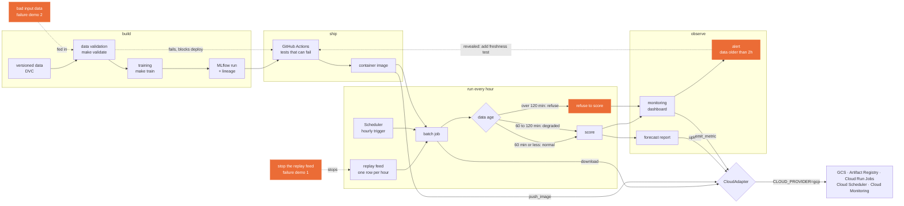

# ED occupancy forecast: architecture reference

Hourly batch forecast of emergency department occupancy one hour ahead, deployed on GCP. This document follows the structure of the course cloud portability reference and applies each section to this project.



## Freshness states

The guard compares the age of the newest row with the scoring time.

| Data age | State | Behaviour |
|---|---|---|
| 60 minutes or less | normal | Score and publish the forecast |
| Over 60 and up to 120 minutes | degraded | Score, publish, and mark the forecast as degraded in the report and in a metric |
| Over 120 minutes | refuse | Do not score, publish nothing new, emit the stale metric, and raise the alert |

The thresholds are read from `FRESH_OK_MINUTES` and `FRESH_STALE_MINUTES` in `cloud.env`, so code never hardcodes them. This table and `cloud.env.example` must always agree.

## Failure demonstrations

The brief requires one deliberate failure. This design has two, each ending in a CI test.

1. Runtime loop: stop the replay feed, data goes stale, the guard refuses, the alert fires, and a CI test checks that the scorer refuses stale input.
2. Build-time loop: feed bad input data, `make validate` fails, the CI test fails, and deployment is blocked.

Demonstration 1 is the main one for the presentation. Demonstration 2 costs little once validation exists.

---

## 1. The three-layer rule

Layer 1, provider-neutral core: Python, Docker, DVC, MLflow, pytest, GitHub Actions, Evidently. The validation script, training script, feature code, freshness guard and scoring function live here.

Layer 2, environment contract: code never hardcodes a bucket, registry host or service name. Everything is read from `cloud.env`. Nothing in `src/` may contain `s3://`, `abfss://`, `gs://`, `amazonaws`, `azure` or `googleapis`. `make audit-src` checks this.

Layer 3, one adapter: `cloudlayer/gcp.py` is the only module that imports the GCP SDK.

Where Google libraries still appear outside the adapter: MLflow writes artifacts to a bucket URI taken from `BLOB_URI`, which needs the `google-cloud-storage` package, and DVC needs `dvc-gs` for its bucket remote. Both are listed in `requirements.txt`, not in `src/`. They authenticate through Application Default Credentials: the runtime service account on Cloud Run, and `gcloud auth application-default login` on a laptop. Set this up together with the service accounts so it is not discovered during the demo.

## 2. The environment contract

`cloud.env` stays out of Git. `cloud.env.example` is committed with empty values.

```bash
CLOUD_PROVIDER=gcp
PROJECT_ID=
REGION=asia-southeast1

BLOB_URI=
CONTAINER_REGISTRY=
MLFLOW_TRACKING_URI=

TRAINING_TARGET=
MODEL_REGISTRY_NAME=ed_occupancy_1h
ENDPOINT_NAME=

METRICS_NAMESPACE=itcs355
SECRET_STORE_PATH=
IDENTITY_REF=

BUDGET_LIMIT_THB=800

MODEL_URI=
FRESH_OK_MINUTES=60
FRESH_STALE_MINUTES=120
SCORE_DEADLINE_MINUTES=5
```

The last four keys are project-specific. `MODEL_URI` points at the model artifact the job loads.

## 3. The adapter interface

The project is batch only, so it uses a subset of the eleven methods.

| Method | Used for |
|---|---|
| `upload` | Write the hourly forecast report and the batch cache to the bucket |
| `download` | Read the cached batch and the model artifact |
| `push_image` | CI pushes the scoring container image |
| `emit_metric` | Data age, state, predictions scored, scoring latency to Cloud Monitoring |
| `teardown` | `make teardown` deletes everything carrying the project labels |
| `submit_training`, `wait_training`, `register_model`, `deploy`, `invoke`, `generate` | Not used. Training runs through `make train`, registration is MLflow, there is no online endpoint and no LLM. Implement as stubs and check whether the course grader expects them |

## 4. Capability mapping and identities (GCP)

| Capability | GCP service | Used for |
|---|---|---|
| Object storage | Cloud Storage | DVC remote, batch cache, forecast reports, MLflow artifact root |
| Container registry | Artifact Registry | Scoring job image |
| Serverless container | Cloud Run Jobs | Hourly freshness guard and scoring |
| Scheduler | Cloud Scheduler | Hourly trigger, set to UTC |
| Metrics | Cloud Monitoring | Dashboard and the stale-data alert |
| Logs | Cloud Logging | Cause of a crash or refusal visible within a minute |
| Secrets | Secret Manager | Any credential the job needs at run time |
| Runtime identity | Service account: runtime | The job reads the bucket and the model artifact, writes metrics, and pulls its image |
| Invoker identity | Service account: invoker | Cloud Scheduler authenticates as this account to start the job |
| Deploy identity | Service account: deployer | GitHub Actions pushes images and updates the job |
| Budget alert | Billing budget | Alert at 50, 80 and 100 percent of the budget |
| Resource grouping | Labels | Teardown and cost attribution |

Scheduler to job. A Cloud Scheduler HTTP job calls the Cloud Run Admin API endpoint that runs the job. For Cloud Run jobs the Google documentation configures Scheduler with an OAuth service account (`--oauth-service-account-email`), not an OIDC token. OIDC is for authenticated Cloud Run services. The invoker service account needs `roles/run.invoker`, granted on the job and not project-wide. Do not reuse the default compute service account.

CI to Google Cloud. Decision: Workload Identity Federation. GitHub Actions exchanges its own OIDC token for short-lived credentials as the deployer service account, so no key file exists anywhere. The fallback, a service account key in GitHub encrypted secrets, is rejected because a leaked or committed key is an automatic deduction.

Permissions per identity. Grant each role at the narrowest scope that works: on the repository, the job or the service account, not on the whole project, where possible.

| Identity | Roles | Scope |
|---|---|---|
| Runtime | `roles/storage.objectAdmin` or a narrower object role, `roles/monitoring.metricWriter`, `roles/logging.logWriter`, `roles/artifactregistry.reader` | Project bucket, project, the image repository |
| Invoker | `roles/run.invoker` | The job only |
| Deployer | `roles/artifactregistry.writer`, `roles/run.developer` or a narrower custom role with job update permission, `roles/iam.serviceAccountUser` | The image repository, the job, the runtime service account |
| GitHub identity pool | `roles/iam.workloadIdentityUser` on the deployer account | Restricted to this repository |

The deployer needs `roles/iam.serviceAccountUser` on the runtime service account because updating a job that runs as that account counts as acting as it. Without it, a deploy fails with a permission error even when the job-update role is present. This is the most likely first failure.

Not used: Vertex AI training, endpoints, batch prediction and pipelines.

## 5. Tracking server

Decision made: local MLflow with a SQLite backend and the artifact root in the bucket (`BLOB_URI`).

Considered and rejected:
- Self-hosted MLflow container on Cloud Run: adds a resource to run, label and tear down, and cold starts, for no graded benefit.
- Vertex AI Experiments: managed but a different API, and the trade-off would have to be documented.

Consequences of this choice, to plan for now:
- The SQLite registry exists only on the machine that trained, so the job cannot resolve a `models:/` name. The job loads the model artifact from the bucket by `MODEL_URI`, which the deploy step sets after the tests pass.
- Lineage is kept by logging the MLflow run ID, model version, data version (DVC hash) and git commit in the job logs and in the forecast report.
- Pick one person to train and register, and record the run ID in the repo, so three people do not end up with three different local registries.

## 6. Labels

Every resource carries the course labels from its first creation.

```
course=itcs355   student=<studentid>   lab=capstone
```

Confirm with the instructor which value `lab` should take for the capstone. Resources to label: buckets, Artifact Registry repository, Cloud Run Job, Cloud Scheduler job, alert policies, service accounts where supported, and the billing budget where supported.

## 7. Cost control

Term target: under 800 THB per student, with a billing budget alert set before building.

| Item | Expectation |
|---|---|
| Cloud Run Jobs | Billed per run, about 720 runs a month, expected within free tier |
| Cloud Scheduler | Expected within free tier for one job |
| Cloud Storage and Artifact Registry | Small monthly storage charge |
| Cloud Monitoring and Logging | Expected within free allotments at this volume |
| Estimate | About 1 to 5 USD per month, about 1.4 to 7 USD per 1,000 predictions at 720 predictions a month |

The estimate is a placeholder. The final report uses the figure from `make cost-report` for resources carrying the project labels.

The billing budget alerts at 50, 80 and 100 percent are notifications only. They do not cap or stop spending. Someone must read them and act, by pausing the Scheduler job or running `make teardown`, if the budget is approached. Send the alerts to an address the whole team sees, and name one owner for responding.

Main risks: a Scheduler job left enabled after submission and storage left behind. There is no real-time endpoint and no always-on tracking server to forget.

## 8. Setup runbook

```bash
git clone https://github.com/ruboon-dej/MLAIOPS-Project && cd MLAIOPS-Project
cp cloud.env.example cloud.env
make setup
make cloud-check
make audit-src
make test
make validate
make train
```

| Target | Status |
|---|---|
| `make setup`, `make validate`, `make train`, `make test`, `make audit-src` | exist in this repo |
| `make cloud-check`, `make teardown`, `make cost-report`, `make portability-audit` | provided by the course repo, not yet copied in |
| `make score`, `make replay`, `make deploy`, `make failure-demo` | do not exist yet |

The four missing targets are the main work of the project. Everything above them is scaffolding, and this document describes the target design, not finished work.

## 9. Where the abstraction leaks

- Cold start is a number to produce, not a risk to note. Measure the time from the Scheduler trigger to the first log line, and the total run time, against `SCORE_DEADLINE_MINUTES`. Measure again after the ML libraries are added to the image, because a heavier image starts slower. Put both figures in the report.
- Scheduler timing. Cloud Scheduler can fire a little after the scheduled minute. Measure the real delay before promising a deadline.
- Time zones. The dataset timestamps and Cloud Scheduler must agree on UTC or a stated zone, otherwise the guard sees data that is hours old or in the future.
- Registry authentication. Docker login to Artifact Registry expires, so a push that worked yesterday can fail today. Workload Identity Federation avoids stored credentials but still needs the deployer account to hold the Artifact Registry writer role.
- Identity propagation. The permission needed to create the job differs from what the job needs at run time. Runtime, invoker and deployer accounts each get only their own permissions.
- Replay clock. The guard is only meaningful if the replay feed emits one row per real hour. Stopping that feed is failure demonstration 1.
